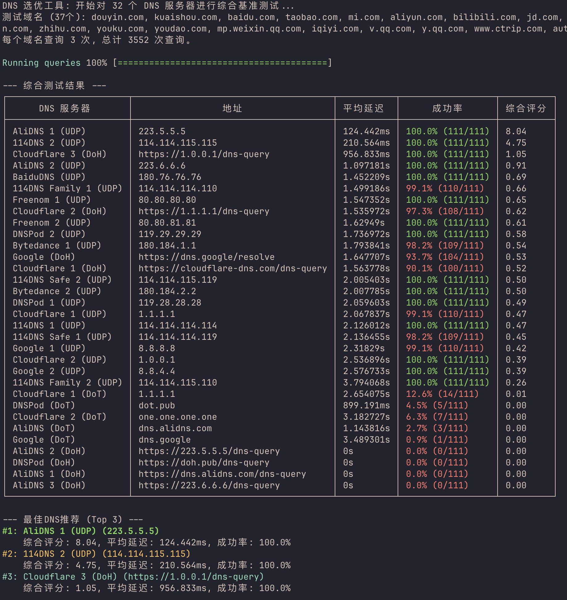

# DNS Optimizer 🚀

[](https://github.com/palemoky/dns-optimizer/actions)
[](https://goreportcard.com/report/github.com/palemoky/dns-optimizer)
[](https://opensource.org/licenses/MIT)

一个跨平台的智能 DNS 选优工具，为您的网络环境推荐最快、最稳定的 DNS 服务器。


DNS 的响应速度和稳定性直接影响您的上网体验。`dns-optimizer` 通过对一系列预设或自定义的 DNS 服务器进行并发基准测试，并基于对多个常用域名的综合表现进行智能评分，帮助您找到当前网络环境下的最优 DNS 设置。

---

## ✨ 功能特性

*   **跨平台支持**: 完美运行于 Windows, macOS, Linux, Raspberry Pi (ARM/ARM64) 等主流平台。
*   **并发测试**: 利用 Go 语言的强大并发能力，在短时间内完成对所有服务器的大量测试。
*   **多协议支持**: 支持传统的 UDP DNS、DNS-over-TLS (DoT) 和 DNS-over-HTTPS (DoH)。
*   **综合评分**: 不仅仅是测速！通过对一组常用域名（如百度、淘宝、Bilibili 等）进行多次查询，结合**平均延迟**和**成功率**给出综合评分。
*   **智能推荐**: 基于综合评分，自动为您推荐 Top 3 的最佳 DNS 服务器。
*   **用户友好的界面**: 清晰的进度条、等待动画和美观的彩色表格，提供专业的命令行工具体验。
*   **高度可定制**: 支持通过命令行参数自定义测试域名列表和每个域名的查询次数。

---

## 📸 运行截图

  

**文本版演示:**
```
DNS 选优工具: 开始对 9 个DNS服务器进行综合基准测试...
测试域名 (7个): www.baidu.com, www.taobao.com, www.douyin.com, www.bilibili.com, www.jd.com, www.qq.com, github.com
每个域名查询 3 次, 总计 189 次查询。

Running queries |██████████████████████████| 189/189 (100%) [7s:0s] 

⠹  正在聚合和计算评分...

--- 综合测试结果 ---
+--------------------+-----------------+------------+--------------+------------+
|    DNS服务器        |        地址     |  平均延迟   |     成功率    |   综合评分   |
+--------------------+-----------------+------------+--------------+------------+
| 阿里DNS (UDP)       | 223.5.5.5       | 9.123ms    | 100.0% (63/63) |  109.61  |
| DNSPod (UDP)       | 119.29.29.29    | 11.456ms   | 100.0% (63/63) |   87.29  |
| 114DNS (UDP)       | 114.114.114.114 | 13.789ms   | 100.0% (63/63) |   72.52  |
| Cloudflare (UDP)   | 1.1.1.1         | 25.123ms   | 98.4% (62/63)  |   38.40  |
+--------------------+-----------------+------------+--------------+------------+

--- 最佳DNS推荐 (Top 3) ---
#1: 阿里DNS (UDP) (223.5.5.5)
    综合评分: 109.61, 平均延迟: 9.123ms, 成功率: 100.0%
#2: DNSPod (UDP) (119.29.29.29)
    综合评分: 87.29, 平均延迟: 11.456ms, 成功率: 100.0%
#3: 114DNS (UDP) (114.114.114.114)
    综合评分: 72.52, 平均延迟: 13.789ms, 成功率: 100.0%
```

---

## 📦 安装

您可以直接从 [GitHub Releases](https://github.com/palemoky/dns-optimizer/releases) 页面下载适用于您操作系统的预编译版本。

1.  前往最新的 Release 页面。
2.  根据您的操作系统和 CPU 架构下载对应的压缩包（例如 `dns-optimizer-windows-amd64.zip`）。
3.  解压后即可直接在终端中使用。

为了方便使用，建议将解压后的可执行文件移动到您系统的 `PATH` 环境变量所包含的目录中（例如 `/usr/local/bin` 或 `C:\Windows\System32`）。

---

## 🚀 使用方法

直接运行即可开始测试：
```bash
./dns-optimizer
```

**自定义参数:**

您可以通过命令行参数自定义测试行为。

```bash
# 查看所有可用参数
./dns-optimizer --help

# 示例：每个域名查询5次，并使用自定义的域名列表
./dns-optimizer -q 5 -d "google.com,github.com,youtube.com"
```

| 参数 | 简写 | 描述 | 默认值 |
|---|---|---|---|
| `--domains` | `-d` | 用于测试的域名列表，以逗号分隔 | `baidu.com,douyin.com,...` |
| `--queries` | `-q` | 每个域名的查询次数 | `3` |

---

## ⚙️ 工作原理

本工具通过以下三个步骤为您提供智能推荐：

1.  **并发测试 (Benchmark)**
    工具会为每一个“DNS服务器”和“测试域名”的组合启动并发的查询任务，并重复指定次数，以收集大量原始延迟数据。

2.  **结果聚合 (Aggregate)**
    在所有查询完成后，程序会聚合每个 DNS 服务器的测试结果，计算出总查询次数、成功次数以及成功的总耗时。

3.  **智能评分与排序 (Score & Rank)**
    这是工具的核心。每个 DNS 服务器的综合评分基于以下公式计算，旨在同时奖励**稳定**和**快速**的服务器：
    
    `Score = (1 / 平均延迟秒数) * (成功率 * 成功率)`

    通过使用**成功率的平方**作为惩罚因子，任何微小的不稳定都会导致评分大幅下降，确保了最终推荐的服务器是绝对可靠的。

---

## 👨‍💻 从源码构建

如果您希望自己编译，请确保您已经安装了 Go (版本 1.25+)。

```bash
# 1. 克隆仓库
git clone https://github.com/palemoky/dns-optimizer.git
cd dns-optimizer

# 2. 获取依赖
go mod tidy

# 3. 编译
go build -o dns-optimizer .

# 4. 运行
./dns-optimizer
```

### 一键交叉编译

项目内提供了 `build.sh` (Linux/macOS) 和 `build.bat` (Windows) 脚本，可以一键为所有目标平台交叉编译可执行文件。

```bash
# 在 Linux 或 macOS 上
chmod +x build.sh
./build.sh
```
编译产物将保存在 `./builds` 目录下。

---

## 🤝 贡献

欢迎任何形式的贡献！如果您有好的想法、发现了 Bug 或者希望添加新的 DNS 服务器到列表中，请随时提交 Pull Request 或创建 Issue。

---

## 📄 许可

本项目采用 [MIT](https://opensource.org/licenses/MIT) 许可协议。
